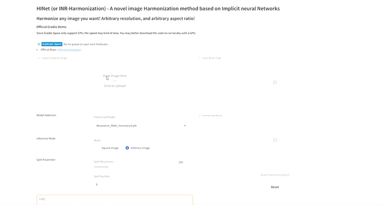

<div align="center">

<h1><a href="https://arxiv.org/abs/2303.01681">Dense Pixel-to-Pixel Harmonization via <br /> Continuous Image Representation</a></h1>


**[Jianqi Chen](https://windvchen.github.io/), [Yilan Zhang](https://scholar.google.com.hk/citations?hl=en&user=wZ4M4ecAAAAJ), [Zhengxia Zou](https://scholar.google.com.hk/citations?hl=en&user=DzwoyZsAAAAJ), [Keyan Chen](https://scholar.google.com.hk/citations?hl=en&user=5RF4ia8AAAAJ),
and [Zhenwei Shi](https://scholar.google.com.hk/citations?hl=en&user=kNhFWQIAAAAJ)**


[](#License)
[](https://arxiv.org/abs/2303.01681)
<a href="https://huggingface.co/spaces/WindVChen/INR-Harmon"></a>

</div>

<p align = "center">    


</p>

<div align="center">

</div>


### Share us a :star: if this repo does help

This repository is the official implementation of ***HINet (or INR-Harmonization)***, which can achieve ***Arbitrary aspect ratio & Arbitrary resolution*** image harmonization. If you encounter any question, please feel free to contact
us. You can create an issue or just send email to me windvchen@gmail.com. Also welcome for any idea exchange and
discussion.

## Updates

[**07/21/2023**] We achieve that!🎉🎉 With all **TODOs** complete! Try here for our [Huggingface Demo](https://huggingface.co/spaces/WindVChen/INR-Harmon)!! You can also download this repository, and run the GUI locally (refer to [cmd](#visualization-gui) here)!🥳🥳

[**07/19/2023**] Hi everyone! We have added two new inference
scripts: [efficient_inference_for_square_image.py](efficient_inference_for_square_image.py) where you can achieve quite
fast speed on harmonizing a ***square image***!
And [inference_for_arbitrary_resolution_image.py](inference_for_arbitrary_resolution_image.py) where you can harmonize
any resolution image ***(2K, 4k, 8k, JUST WHATEVER YOU WANT!!)***. Please check them out!😉😉

A summary of features of different inference strategies (More information please refer to [Inference](#inference)):

|        Features         | [efficient_inference_for_square_image.py](efficient_inference_for_square_image.py) |         [inference_for_arbitrary_resolution_image.py](inference_for_arbitrary_resolution_image.py)          |
|:-----------------------:|:----------------------------------------------------------------------------------:|:-----------------------------------------------------------------------------------------------------------:|
| Support Arbitrary Image |                               ❌ *(Only squre image)*                               |                            ✅ *(Arbitrary aspect ratio, Arbitrary resolution!!!)*                            |
|          Speed          |                                 🚀 *(Quite fast)*                                  |                                 🚌 *(Relatively slower than the left one)*                                  |
|       Memory cost       |                                  🌲 *(Quite low)*                                  |                     🏭 *(Relatively higher than the left one for the same resolution)*                      |

[**07/18/2023**] Check out our new work [***Diff-Harmonization***](https://github.com/WindVChen/Diff-Harmonization),
which is a **Zero-Shot Harmonization** method based on *Diffusion Models*!😊

[**07/17/2023**] Pretrained weights have been released. Feel free to try that!👋👋

[**07/16/2023**] The code is initially public. 🥳

[**03/06/2023**] Source code and pretrained models will be publicly accessible.

## TODO

- [x] Initial code release.
- [x] Add pretrained model weights.
- [x] Add the efficient splitting strategy for inferencing on original resolution images.
- [x] Add Gradio demo.

## Table of Contents

- [Visualization GUI](#Visualization-GUI)
- [Abstract](#abstract)
- [Requirements](#requirements)
- [Training](#training)
    - [Train in low resolution (LR) mode](#train-in-low-resolution--lr--mode)
    - [Train in high resolution (HR) mode](#train-in-high-resolution--hr--mode--eg-2048x2048-)
    - [Train in original resolution mode](#train-in-original-resolution-mode)
- [Evaluation](#evaluation)
    - [Evaluation in low resolution (LR) mode](#evaluation-in-low-resolution--lr--mode)
    - [Evaluation in high resolution (HR) mode](#evaluation-in-high-resolution--hr--mode--eg-2048x2048-)
    - [Evaluation in original resolution mode](#evaluation-in-original-resolution-mode)
- [Inference](#inference)
    - [Inference on square images (fast & low cost)](#inference-on-square-images--fast--low-cost-)
    - [Inference on arbitrary resolution images (Support any resolution)](#Inference-on-arbitrary-resolution-images--slow-high-cost-but-support-any-resolution-)
- [Results](#results)
- [Citation & Acknowledgments](#citation--acknowledgments)
- [License](#license)


## Visualization GUI

We provide a GUI based on Gradio for visualizing the intermediate results of our method. You can run the following command to start it locally, or make use of our provided [Huggingface Space](https://huggingface.co/spaces/WindVChen/INR-Harmon).
```bash
python app.py
```

## Abstract


High-resolution (HR) image harmonization is of great significance in real-world applications such as image synthesis and
image editing. However, due to the high memory costs, existing dense pixel-to-pixel harmonization methods are mainly
focusing on processing low-resolution (LR) images. Some recent works resort to combining with color-to-color
transformations but are either limited to certain resolutions or heavily depend on hand-crafted image filters. In this
work, we explore leveraging the implicit neural representation (INR) and propose a novel
***image Harmonization method based on Implicit neural Networks (HINet)***, which to the best of our knowledge, is
***the first dense pixel-to-pixel method applicable to HR images without any hand-crafted filter design***. Inspired by
the Retinex theory, we decouple the MLPs into two parts to respectively capture the content and environment of composite
images. A Low-Resolution Image Prior (LRIP) network is designed to alleviate the Boundary Inconsistency problem, and we
also propose new designs for the training and inference process. Extensive experiments have demonstrated the
effectiveness of our method compared with state-of-the-art methods. Furthermore, some interesting and practical
applications of the proposed method are explored.

## Requirements

1. Software Requirements
    - Python: 3.8
    - CUDA: 11.3
    - cuDNN: 8.4.1

   To install other requirements:

   ```
   pip install -r requirements.txt
   ```

2. Datasets
    - We train and evaluate on the [iHarmony4 dataset](https://github.com/bcmi/Image-Harmonization-Dataset-iHarmony4).
      Please download the dataset in advance, and arrange them into the following structure:

   ```
   ├── dataset_path
      ├── HAdobe5k
         ├── composite_images
         ├── masks
         ├── real_images
      ├── HCOCO
      ├── Hday2night
      ├── HFlickr
      IHD_test.txt
      IHD_train.txt
   ```

    - Before training we resize HAdobe5k subdataset so that each side is smaller than 1024. This is for quick data
      loading. The resizing script can refer to [resize_Adobe.py](tools/resize_Adobe.py).

    - For training or evaluating on the original resolution of iHarmony4 dataset. Please newly create a `HAdobe5kori`
      directory with the original HAdobe5k images in it.

    - If you want to train and evaluate only on HAdobe5k subdataset (see Table 1 in the paper), you can modify
      the `IHD_train.txt` and `IHD_test.txt` in [train.py](train.py) to only contain the HAdobe5k images.

3. Pre-trained Models
    - We adopt [HRNetV2](https://github.com/HRNet/HRNet-Image-Classification) as our encoder, you can download the
      weight
      from [here](https://onedrive.live.com/?authkey=%21AMkPimlmClRvmpw&id=F7FD0B7F26543CEB%21112&cid=F7FD0B7F26543CEB&parId=root&parQt=sharedby&parCid=C8304F01C1A85932&o=OneUp)
      and save the weight in `pretrained_models` directory.
    - In the following table, we provide several model weights pretrained under different resolutions (Correspond to
      Table 1 in the paper):

|                      Download Link                       |                         Model Descriptions                          |
|:--------------------------------------------------------:|:-------------------------------------------------------------------:|
| [Resolution_RAW_iHarmony4.pth][Resolution_RAW_iHarmony4] |  Train by RSC strategy with original resolution iHarmony4 dataset   |
| [Resolution_256_iHarmony4.pth][Resolution_256_iHarmony4] |           Train with 256*256 resolution iHarmony4 dataset           |
|  [Resolution_RAW_HAdobe5K.pth][Resolution_RAW_HAdobe5K]  | Train by RSC strategy with original resolution HAdobe5k subdataset  |
| [Resolution_2048_HAdobe5K.pth][Resolution_2048_HAdobe5K] | Train by RSC strategy with 2048*2048 resolution HAdobe5k subdataset |
| [Resolution_1024_HAdobe5K.pth][Resolution_1024_HAdobe5K] | Train by RSC strategy with 1024*1024 resolution HAdobe5k subdataset |

[Resolution_RAW_iHarmony4]: https://drive.google.com/file/d/1O9faWNk54mIzMaGZ1tmgm0EJpH20a-Fl/view?usp=drive_link

[Resolution_256_iHarmony4]: https://drive.google.com/file/d/1xym96LTP9a75UseDWGW2KRN1gyl3HPyM/view?usp=sharing

[Resolution_RAW_HAdobe5K]: https://drive.google.com/file/d/1JeUS5inuOM0pASKfu-tK9K7E5pGkP570/view?usp=drive_link

[Resolution_2048_HAdobe5K]: https://drive.google.com/file/d/18RxTfZsPEoi6kSS_UVEsUBYRBHAl4MfB/view?usp=drive_link

[Resolution_1024_HAdobe5K]: https://drive.google.com/file/d/1cOY74mN8gIz66watyoobZ1knrigkQyb5/view?usp=sharing


## Training

The intermediate output (including checkpoint, visualization, log.txt) will be saved in directory `logs/exp`.

### Train in low resolution (LR) mode

```bash
python train.py --dataset_path {dataset_path} --base_size 256 --input_size 256 --INR_input_size 256
```

- `dataset_path`: the path of the iHarmony4 dataset.
- `base_size`: the size of the input image to encoder.
- `input_size`: the size of the target resolution.
- `INR_input_size`: the size of the input image to the INR decoder.
- `hr_train`: whether to train in high resolution (HR) mode, i.e., using RSC strategy (See Section 3.4 in the paper).
- `isFullRes`: whether to train in full/original resolution mode.

- (More parameters' information could be found in codes ...)

### Train in high resolution (HR) mode (E.g, 2048x2048)

If **not use RSC strategy**, the training command is as follows: (For a single RTX 3090, it will lead to out-of-memory
even `batch_size` is set to 2.)

```bash
python train.py --dataset_path {dataset_path} --base_size 256 --input_size 2048 --INR_input_size 2048
```

If **use RSC strategy**, the training command is as follows: (For a single RTX 3090, `batch_size` can set up to 6.)

```bash
python train.py --dataset_path {dataset_path} --base_size 256 --input_size 2048 --INR_input_size 2048 --hr_train
```

### Train in original resolution mode

```bash
python train.py --dataset_path {dataset_path} --base_size 256 --hr_train --isFullRes
```

## Evaluation

The intermediate output (including visualizations, log.txt) will be saved in directory `logs/test`.

**Notice:** Due to the resolution-agnostic characteristic of INR, you can evaluate dataset at any resolution not matter
which resolution the model is trained on. Please refer to Table 4 and Table 5 in the paper.

### Evaluation in low resolution (LR) mode

```bash
python inference.py --dataset_path {dataset_path} --pretrained {pretrained_weight} --base_size 256 --input_size 256 --INR_input_size 256
```

### Evaluation in high resolution (HR) mode (E.g, 2048x2048)

```bash
python inference.py --dataset_path {dataset_path} --pretrained {pretrained_weight} --base_size 256 --input_size 2048 --INR_input_size 2048
```

### Evaluation in original resolution mode

```bash
python inference.py --dataset_path {dataset_path} --pretrained {pretrained_weight} --base_size 256 --hr_train --isFullRes
```

## Inference

We have provided demo images (2K and 6K) in [demo](demo). Feel free to play around them.

**Notice:** Due to the resolution-agnostic characteristic of INR, you can inference images at any resolution not matter
which resolution the model is trained on. Please refer to Table 4 and Table 5 in the paper.

### Inference on square images (fast & low cost)

If you want to inference on square images, please use the command here. Note that this code only support square images with resolution of multiplies of 256. Some other requirements will be listed in cmd prints (if error) when you run the code.

```bash
python efficient_inference.py --split_resolution {split_resolution} --composite_image {composite_image_path} --mask {mask_path} --save_path --{save_path} --pretrained {pretrained_weight}
```
- `split_resolution`: the resolution of the split patches. (E.g., 512 means the input image will be split into 512x512 patches.) These patches will finally be assembled back to the resolution of the original image.
- `composite_image`: the path of the composite image. You can try with the provided images in [demo](demo).
- `mask`: the path of the mask. You can try with the provided masks in [demo](demo).
- `save_path`: the path of the output image.
- `pretrained`: the path of the pretrained weight.

### Inference on arbitrary resolution images (slow, high cost, but support any resolution)
If the former inference script cannot meet your needs and you want to inference on arbitrary resolution images, please use the command here. Note that this script will be slower and cost more memory for a same resolution (***But anyway, it supports arbitrary resolution***).

If you encounter out-of-memory error, please try to reduce the `split_num` parameter below. (Our script will also have some prints that can guide you to do this)
```bash
python inference_for_arbitrary_resolution.py --split_num {split_num} --composite_image {composite_image_path} --mask {mask_path} --save_path --{save_path} --pretrained {pretrained_weight}
```
- `split_num`: the number of splits for the input image. (E.g., 4 means the input image will be split into 4x4=16 patches.)
- `composite_image`: the path of the composite image. You can try with the provided images in [demo](demo).
- `mask`: the path of the mask. You can try with the provided masks in [demo](demo).
- `save_path`: the path of the output image.
- `pretrained`: the path of the pretrained weight.

## Results


## Citation & Acknowledgments

If you find this paper useful in your research, please consider citing:

```
@article{chen2023dense,
  title={Dense Pixel-to-Pixel Harmonization via Continuous Image Representation},
  author={Chen, Jianqi and Zhang, Yilan and Zou, Zhengxia and Chen, Keyan and Shi, Zhenwei},
  journal={arXiv preprint arXiv:2303.01681},
  year={2023}
}
```

## License

This project is licensed under the Apache-2.0 license. See [LICENSE](LICENSE) for details.